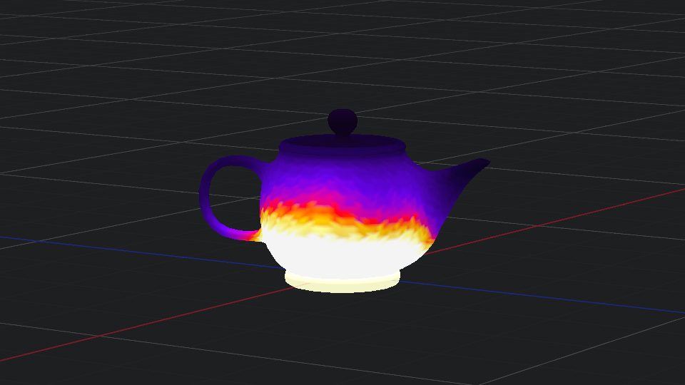

# HeatSpectra

Realtime thermal analysis visualization using tetrahedral mesh elements and compute shaders

## Requirements
- Vulkan SDK 1.3
- Visual Studio 2022

## Quick Start
Download and run HeatSpectra.exe within the 'x64/Release' folder. Requires Windows 10 and a Vulkan capable GPU.

## Setup
1. Clone the repository
2. Build shaders using `compile.bat` in `shaders` folder
3. Open solution in Visual Studio 2022
4. Build and run in Release mode

## Controls
- W A S D Q E camera controls
- Arrow keys for heat source control
- H key for wireframe view
